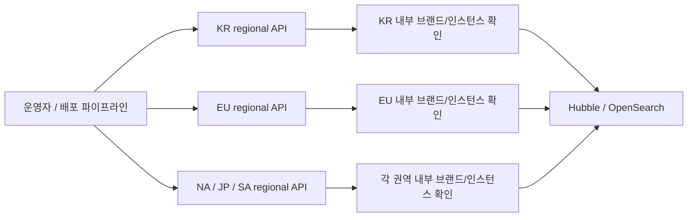
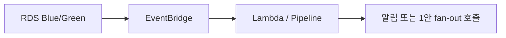

# RDS Blue/Green 전환 준비 상태 확인 방안

## 배경 메모

처음에는 AWS Advanced JDBC Wrapper 자체에서 Green DB 인지 상태를 로그로 남기거나, 해당 값을 쉽게 가져와서 Hubble/OpenSearch에 뿌릴 수 있을 것으로 봤습니다.

확인 결과, Wrapper가 “각 인스턴스가 Green DB를 인지했고 switchover 준비가 됐다”는 형태의 로그를 별도로 남기지는 않았습니다. 결국 이 상태를 확인하려면 서버에서 주기적으로 체크하거나, 필요 시점에 별도 API를 호출해야 합니다.

따라서 평시 스케줄링 로그를 계속 남기기보다는, switchover 전에만 **1안의 readiness fan-out API 방식**으로 확인하는 방향이 적합하다고 판단했습니다.

---

## 결론

기본안은 **1안. 인스턴스별 readiness fan-out API**입니다.

2안 EventBridge는 AWS 이벤트 감지에는 유용하지만, 각 애플리케이션 인스턴스가 실제로 Green DB 전환 준비 상태인지까지는 알 수 없으므로 보조 수단으로 봅니다.

---

## 비교

| 구분 | 방식 | 확인 가능한 것 | 한계 |
|---|---|---|---|
| 1안 | 인스턴스별 readiness API fan-out | 각 서버가 실제로 준비됐는지 확인 | 호출 대상 목록/네트워크 경계 관리 필요 |
| 2안 | AWS EventBridge | RDS Blue/Green 이벤트 감지 | 앱 인스턴스별 준비 여부는 알 수 없음 |

---

## 1안. 인스턴스별 readiness API fan-out

권역별 regional API를 호출하고, 해당 regional API가 자기 권역 내부 인스턴스만 확인하는 방식입니다.

KR, EU, NA, JP, SA는 서로 다른 AWS 리전/내부망이므로 하나의 중앙 API가 모든 권역 인스턴스를 직접 호출하는 구조는 적합하지 않습니다.



### 호출 예시

```http
POST https://kr-readiness.internal/internal/rds-bluegreen/readiness/fanout?brand=KIA
POST https://kr-readiness.internal/internal/rds-bluegreen/readiness/fanout?brand=HYUNDAI
POST https://kr-readiness.internal/internal/rds-bluegreen/readiness/fanout?brand=GENESIS

POST https://eu-readiness.internal/internal/rds-bluegreen/readiness/fanout?brand=KIA
POST https://na-readiness.internal/internal/rds-bluegreen/readiness/fanout?brand=KIA
```

regional API 내부에서는 같은 권역 인스턴스에만 호출합니다.

```http
POST http://{same-region-instance-host}/api/rds-bluegreen/readiness
```

### 권역 내부 처리 기준

| 구조 | 처리 방식 |
|---|---|
| 3개 브랜드가 같은 SG 또는 서로 호출 가능한 SG 묶음 | 하나의 KR regional API가 브랜드별로 fan-out |
| 브랜드별 SG가 분리되어 호출 불가 | 브랜드/SG 단위로 fan-out 분리 |
| regional API에서 각 브랜드 SG로 호출 가능 | regional API SG에서 각 브랜드 SG로 ingress 허용 |

Security Group은 대상 목록 저장소가 아니라 **호출 가능한 네트워크 경계**로 봅니다.

대상 목록은 ALB Target Group, Cloud Map, AppConfig, SSM Parameter Store 같은 discovery/config에서 관리하는 편이 적합합니다.

### 확인 로그

```text
RDS_BLUE_GREEN_READINESS_SUMMARY allReady=true region=KR brand=KIA totalInstances=6 readyInstances=6 notReadyInstances=0
```

---

## 2안. AWS EventBridge

RDS Blue/Green 배포 생성, 상태 변경, switchover 관련 이벤트를 EventBridge로 감지하는 방식입니다.



### 사용 방식

- Blue/Green 관련 AWS 이벤트 감지
- 운영 알림 발송
- 가능할 경우 1안 readiness fan-out API 자동 호출

### 한계

- EventBridge는 AWS 리소스 이벤트만 알려줍니다.
- 각 애플리케이션 인스턴스가 실제로 Green DB 준비 상태를 인지했는지는 알 수 없습니다.
- 따라서 EventBridge만으로 switchover 준비 완료를 판단하면 안 됩니다.

---

## 최종 진행안

1. Blue/Green 배포 생성
2. 1안 기준으로 권역별 regional fan-out API 호출
3. regional API가 권역 내부 브랜드/인스턴스 readiness 확인
4. Hubble/OpenSearch에 요약 로그 적재
5. 모든 권역/브랜드가 `allReady=true`이면 switchover 진행
6. EventBridge는 가능할 경우 1안 호출을 자동화하는 보조 수단으로 사용
